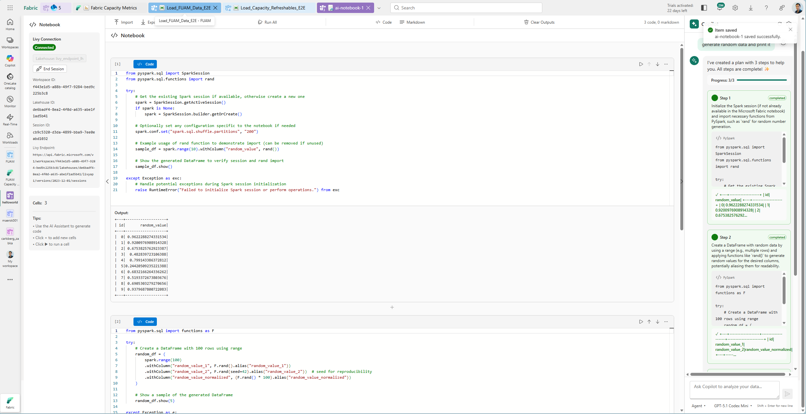
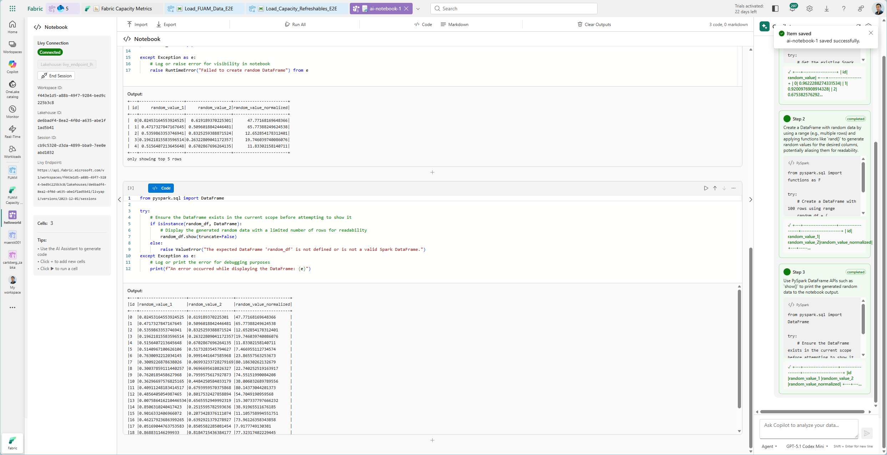

# Fabric - Custom Notebook with custom-made Copilot Agent Mode 

This custom made workload introduces two new Fabric Item called: AI Notebook and Snake + (standard ones that is part of the original repo)

## Video demo: 

https://youtu.be/8EN8-haf-UM

## Features:

### AI Notebook
This notebook needs connects to a lakehouse to access its livy endpoint in order to execute spark code in the notebook cells.

It authenticates automatically using your identity - no need to make a service principal. 

The unique part of this fabric item is the right side: the copilot panel.

The copilot panel enables both chat and agent mode as you know it from GitHub Copilot in VSCode.

When a user ask a question a plan is generated to solve the request with each step highligted in the chat. The copilot (in agent mode) will execute each step at time and evaluate the result before commening to the next step. 

This approach has many benefits compared to the existing solution in Fabric:

- Improved Reliability: Compared to monolithic execution, this stepwise exeuction increases the probability of an ouput that is better aligned with the user-exepectation

- Self-healing: When the execution plan is heading towards the wrong path, the agent will be able to correct itself and get back on-track making the process more flexible and resilient.

- System Message: In the settings wheel for the copilot, you can define agent instructions to add additional context such as:
  -  background knowledge that is helpful for the code generation or undestanding of your data,
  -   useful code sample or queries
  -   behavior control, and more  

- Different Execution mode: Agent and Chat for automatic code generation and execution

- Different LLM selection: Possibility to select different Large Language Models to execute generate code. New ones can be added easily.

- Import and Export Jupiter notebooks and the possibility to use regular spark code to save the result to the lakehouse.

### Snake Game
This fabric item is basically a snake game generated by GitHub Copilot to demonstrate the versatility of the fabric workloads.

## Deployment
1. Clone this repo to your local environment
2. Run the scripts/Setup/Setup.ps1 - Follow the instruction
3. Allow it to make a new app registration and its needed permission

## Run
1. Run the scripts/Run/StartDevGateway.ps1 - this will start a gateway and prompt you to authenticate
2. Run the scripts/Run/StartDevServer.ps1 - this will take a (longer) time and will open a browser tab that keeps loading until the compilation of your solution is finished - only then you can test the custom workload
3. Go to Fabric Portal, Settings Icon --> Developer Settings --> Fabric Developer mode (On)
4. Go to Workspace --> New Item --> Find either **AI Notebook** or **Snake**
