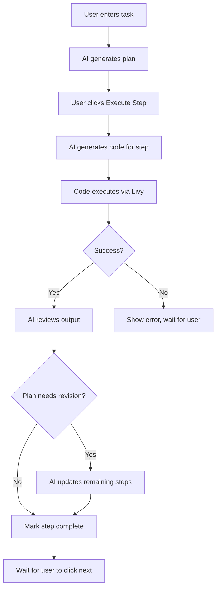
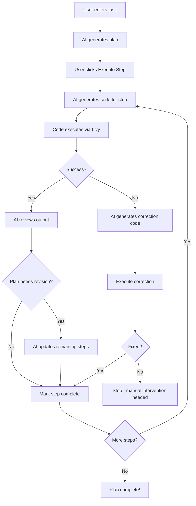

# AI Agent Notebook Feature

## Overview

The AI Agent Notebook is an intelligent, adaptive notebook interface that combines the power of Azure OpenAI with Microsoft Fabric's Spark Livy execution engine. It provides an AI-assisted coding experience where the agent can plan, execute, review, and self-correct code to accomplish data analysis tasks.

## Key Features

### 1. **AI-Powered Plan Generation**
- Enter a natural language task description (e.g., "Analyze sales data and find top 10 customers")
- The AI generates a step-by-step execution plan with 3-5 actionable steps
- Each step is designed to be executable as PySpark code

### 2. **Adaptive Code Generation**
- For each step, the AI generates contextually aware PySpark code
- Code is tailored to the current step's requirements
- Includes proper error handling and Spark best practices

### 3. **Livy Session Integration**
- Connect to a Microsoft Fabric Lakehouse via Spark Livy API
- Select your lakehouse using the built-in data hub picker
- Execute PySpark code in real-time against your data
- View execution time and detailed output for each cell

### 4. **Intelligent Review & Self-Correction**
After each step execution, the AI agent:
- **Analyzes the output** to determine if the step achieved its goal
- **Adapts the plan** based on discovered information (schema, column names, data patterns)
- **Self-corrects errors** by generating and executing fix code automatically
- **Revises remaining steps** if the output reveals the need for additional data preparation

### 5. **Agent Mode**
When Agent Mode is enabled:
- Automatically proceeds to the next step after successful execution
- Attempts to fix errors automatically with correction code
- Continues until the plan is complete or an unrecoverable error occurs

## Architecture

```
┌─────────────────────────────────────────────────────────────────┐
│                     AI Agent Notebook UI                        │
├─────────────┬─────────────────────────────┬─────────────────────┤
│  Left Panel │       Center Panel          │    Right Panel      │
│  ─────────  │       ────────────          │    ───────────      │
│  • Livy     │  • Notebook Editor          │  • AI Assistant     │
│    Status   │  • Code Cells               │  • Plan Display     │
│  • Session  │  • Output Display           │  • Step Status      │
│    Info     │  • Execution Time           │  • Agent Mode       │
│  • Tips     │  • Error Details            │    Toggle           │
└─────────────┴─────────────────────────────┴─────────────────────┘
                              │
                              ▼
┌─────────────────────────────────────────────────────────────────┐
│                    Azure OpenAI Client                          │
│  ───────────────────────────────────────────────────────────    │
│  • generatePlan()      - Create execution plan from task        │
│  • generateCode()      - Generate PySpark for a step            │
│  • reviewAndRevise()   - Analyze output & adapt plan            │
└─────────────────────────────────────────────────────────────────┘
                              │
                              ▼
┌─────────────────────────────────────────────────────────────────┐
│                    Spark Livy Client                            │
│  ───────────────────────────────────────────────────────────    │
│  • createSession()     - Start Spark session                    │
│  • submitStatement()   - Execute PySpark code                   │
│  • getStatement()      - Poll for results                       │
│  • deleteSession()     - Clean up session                       │
└─────────────────────────────────────────────────────────────────┘
                              │
                              ▼
┌─────────────────────────────────────────────────────────────────┐
│              Microsoft Fabric Lakehouse                         │
│  ───────────────────────────────────────────────────────────    │
│  • Spark execution engine                                       │
│  • Delta tables                                                 │
│  • Data files                                                   │
└─────────────────────────────────────────────────────────────────┘
```

## Execution Flow

### Standard Flow (Agent Mode OFF)



### Agent Mode Flow (Agent Mode ON)



## Configuration

### Azure OpenAI Setup

Add the following to your `.env.dev` file:

```env
# Azure OpenAI Configuration
AZURE_OPENAI_ENDPOINT=https://your-resource.openai.azure.com/
AZURE_OPENAI_API_KEY=your-api-key-here
AZURE_OPENAI_DEPLOYMENT=gpt-4
AZURE_OPENAI_API_VERSION=2024-02-15-preview
```

### Livy Connection

1. Click the "Connect" button in the left panel
2. Select a Lakehouse from the data hub picker
3. Wait for the Spark session to initialize (may take 1-2 minutes)
4. Session state will show "idle" when ready

## Usage Guide

### Basic Usage

1. **Connect to Livy** (optional but recommended for real execution)
   - Click "Connect" in the left panel
   - Select your Lakehouse
   - Wait for session to become "idle"

2. **Enter a Task**
   - In the AI Assistant panel (right side), enter your task
   - Example: "Load the sales table and show the top 10 customers by revenue"

3. **Generate Plan**
   - Click "Generate Plan"
   - Review the generated steps

4. **Execute Steps**
   - Click "Execute Step" to run each step
   - View the output in the notebook cells
   - The AI will analyze results and adjust the plan if needed

### Using Agent Mode

1. **Enable Agent Mode**
   - Toggle the "Agent Mode" switch in the AI Assistant panel

2. **Start Execution**
   - Click "Execute Step" to begin
   - The agent will automatically:
     - Generate and execute each step
     - Review outputs and adapt the plan
     - Attempt to fix any errors
     - Continue until complete

3. **Monitor Progress**
   - Watch the cells populate with code and output
   - Review the step status in the AI Assistant panel
   - Check notifications for plan revisions

## AI Review & Adaptation

The AI agent reviews each execution result and can:

### Analyze Output
- Check if the output matches the step's intended goal
- Identify data characteristics (schema, row counts, column names)
- Detect potential issues or unexpected results

### Revise the Plan
When the output reveals new information:
- **Schema Discovery**: Adjusts column references in remaining steps
- **Data Preparation Needs**: Inserts additional cleaning/transformation steps
- **Goal Adjustment**: Modifies approach based on actual data

### Self-Correct Errors
When an error occurs:
- Analyzes the error message and traceback
- Generates correction code to fix the issue
- Automatically executes the fix (in Agent Mode)
- Continues with the plan after successful correction

## Example Session

**Task**: "Analyze the orders table and find the average order value by month"

**Generated Plan**:
1. Load data from the orders table
2. Explore the data structure and identify date/amount columns
3. Extract month from date and calculate average order value
4. Display results sorted by month

**Execution with Adaptation**:

```
Step 1: Load data
Output: "Loaded 50,000 rows. Columns: order_id, customer_id, order_date, total_amount, status"

AI Review: "Data loaded successfully. Identified 'order_date' as date column and 'total_amount' as value column."

Step 2: Explore data
Output: "order_date type: timestamp, total_amount type: double, null counts: order_date=0, total_amount=12"

AI Review: "Found 12 null values in total_amount. Revising plan to handle nulls."

[Plan Revised - Added data cleaning step]

Step 3: Clean null values
Output: "Filtered out 12 rows with null total_amount. Remaining: 49,988 rows"

Step 4: Calculate monthly averages
Output: "
| month    | avg_order_value |
|----------|-----------------|
| 2024-01  | $145.32         |
| 2024-02  | $167.89         |
..."

AI Review: "Successfully calculated monthly averages. Plan complete!"
```

## Error Handling

### Connection Errors
- Session creation timeout: Retry or check Fabric capacity
- Statement execution failed: Check Livy session state

### Execution Errors
- Syntax errors: AI attempts to fix and re-execute
- Table not found: AI may suggest creating or specifying correct table name
- Column not found: AI adapts based on discovered schema

### AI Service Errors
- If Azure OpenAI is unavailable, falls back to mock responses
- Check API key and endpoint configuration

## Components

| Component | File | Description |
|-----------|------|-------------|
| Notebook Editor | `HelloWorldItemEditorNotebook.tsx` | Main notebook UI and execution logic |
| Assistant Panel | `AssistantPanel.tsx` | AI plan display and controls |
| Notebook Cells | `NotebookEditor.tsx` | Code cells with Monaco editor |
| Azure OpenAI Client | `AzureOpenAIClient.ts` | AI plan generation and review |
| Spark Livy Client | `SparkLivyClient.ts` | Livy API wrapper for Spark execution |

## Best Practices

1. **Start with a clear task description** - Be specific about what you want to achieve
2. **Review the generated plan** - Ensure the steps make sense before executing
3. **Connect to Livy for real execution** - Simulated mode is useful for testing but doesn't run actual Spark code
4. **Use Agent Mode for routine tasks** - Let the AI handle straightforward analyses
5. **Disable Agent Mode for sensitive operations** - Review each step when working with production data
6. **Check execution times** - Long-running steps may indicate performance issues

## Limitations

- Requires Azure OpenAI API access for full functionality
- Spark session initialization can take 1-2 minutes
- Large outputs may be truncated in the review process
- Complex multi-table operations may require manual intervention
- Agent Mode correction attempts are limited to prevent infinite loops

## Future Enhancements

- [ ] Support for multiple Lakehouse connections
- [ ] Conversation history for context-aware follow-up tasks
- [ ] Export notebook to standard .ipynb format
- [ ] Integration with Fabric Git workflows
- [ ] Support for SQL and Scala code generation
- [ ] Visualization recommendations based on output data
